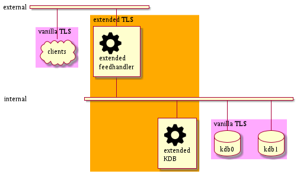
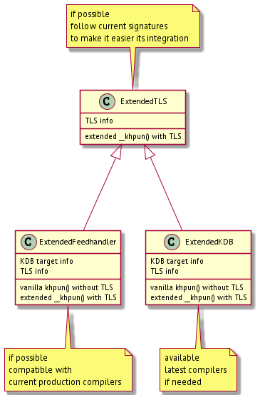

# kdbExtension

Several examples to extend **kdb+** using latest compilers in a way it can be executed on Linux systems with older ones: 

- [helloWorld](helloWorld/) basic **cmake** file following [official documentation](https://code.kx.com/q/interfaces/using-c-functions) and some logs to check your development environments, including **docker** builds.

- [helloAsio](helloAsio/) basic jog-your-memory example on [Asio](https://think-async.com/Asio) library, mixing more legacy multithreading approaches with new ones. That's the typical situation when you want to extend current production products.

- [helloTLS](helloTLS/) basic TLS example, trying to double check that it's possible to open different TLS connection from different threads in the very same process. That seems to be a limitation at current *kdb+* 4.0 version and there must be a good reason for that.

- [helloTLSKdb](helloTLSKdb/) basic extension of current non-TLS connection *kdb* functions, where multithreading is not an issue, to use what learnt about TLS in the previous POC. Once double checked this part, it's when you can start estimating how long it might take extend your current production products, including all the DevOps and Testing involved.

[link to diagram image](https://raw.githubusercontent.com/xue2sheng/kdbExtension/main/images/diagram.png)

Take into account that if you really want to extend your KDB production products, High Availability should be considered. For example, some kind of Load Balancers and at least the minimum scenario of A/B sides (automatically reconnecting to the 'live' side). No 'hello' example for that yet.

[link to code image](https://raw.githubusercontent.com/xue2sheng/kdbExtension/main/images/code.png)
